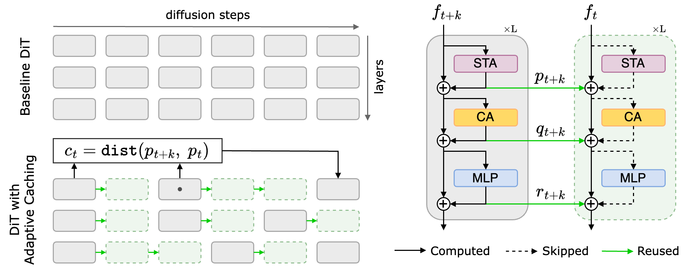

# Adaptive Caching for Faster Video DiTs

This is the official implementation for the paper, [Adaptive Caching for Faster Video Generation
with Diffusion Transformers](https://adacache-dit.github.io/clarity/adacache_meta.pdf).

## **Introduction**

Generating temporally-consistent high-fidelity videos can be computationally expensive, especially over longer temporal spans. More-recent Diffusion Transformers (DiTs)--- despite making significant headway in this context--- have only heightened such challenges as they rely on larger models and heavier attention mechanisms, resulting in slower inference speeds. In this paper, we introduce a training-free method to accelerate video DiTs, termed Adaptive Caching (AdaCache), which is motivated by the fact that "not all videos are created equal": meaning, some videos require fewer denoising steps to attain a reasonable quality than others. Building on this, we not only cache computations through the diffusion process, but also devise a caching schedule tailored to each video generation, maximizing the quality-latency trade-off. We further introduce a Motion Regularization (MoReg) scheme to utilize video information within AdaCache, essentially controlling the compute allocation based on motion content. Altogether, our plug-and-play contributions grant significant inference speedups without sacrificing the generation quality, across multiple video DiT baselines.

<div align="center">

</div>

## **Installation**

Please follow the steps in [installation guide](https://github.com/AdaCache-DiT/AdaCache/tree/main/opensora_base#installation) to install Open-Sora baseline.

## **Run inference**

Run our video generation pipeline on a single A100 (80G) GPU as follows:
- Baseline

  ```bash run_sample_video.sh configs/sample.py```
  
- AdaCache
  
  ```bash run_sample_video.sh configs/sample_adacache.py```
  
- AdaCache+MoReg
  
  ```bash run_sample_video.sh configs/sample_adacache_moreg.py```

If running on a new set of prompts, change the prompt path and first generate initial images using:

```bash run_sample_image.sh configs/sample.py```

## Citation

If you find this useful, please consider citing our work:

```
@article{adacache,
    title={Adaptive Caching for Faster Video Generation with Diffusion Transformers},
    author={Kumara Kahatapitiya, Haozhe Liu, Sen He, Ding Liu, Menglin Jia, Chenyang Zhang, Michael S. Ryoo, and Tian Xie},
    journal={arXiv preprint},
    year={2024}
}
```

## Acknowledgement

This implementation is based on [Open-Sora](https://github.com/hpcaitech/Open-Sora). We would like to thank the contributors for their open-source implementation.
